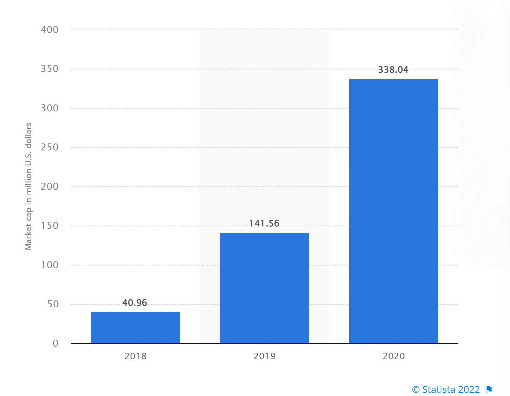

# 🎀 Overview

According to Statista in April 2022, the global NFT market in 2020 is $338 million.

Then it saw a meteoric rise in 2021, with a total trading volume hit over $40 billion. This growth can be attributed to the increasing demand for digital artworks.

But the composable opportunities of digital artworks have been underestimated. And SoulMade is a platform that gives an opportunity for composable NFTs!
