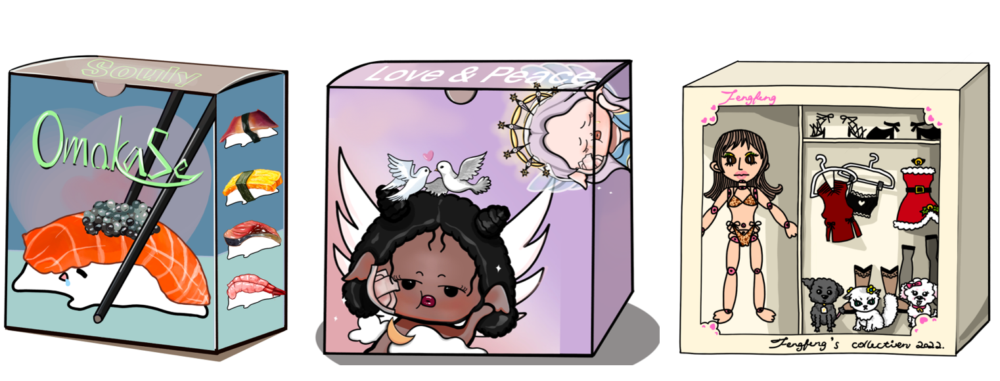

# 🧩 Sales Model Intro

SoulMade offers a new business model for digital artworks.&#x20;

We have direct sales (drops) and mystery box marketing for professional artworks from our exclusive cooperated artists. And also provide a trading marketplace for re-creations explored by our creators.

Drops

Professional artworks from SoulMade can be sold as complete drop sets, as well as separate components. And we made it possible for every artwork to be disassembled and assembled!

Our users can buy any drop components they like and treat them like bricks to build different NFTs according to their own creations!

.png>)

Mystery Box

It’s a more interesting sale model for professional artworks. We have two types of mystery boxes: basic ones and membership-only ones.

Users of different grades will have the corresponding permissions to buy different series of mystery boxes. And each mystery box will come with a set of NFTs and for a chance to win rare NFTs, likewise, they can be disassembled and assembled into a unique creation.

Marketplace&#x20;

A place that allows our artists, creators, and collectors to trade their artworks and re-creations freely.&#x20;

We hope everyone's ideas and creativity will be seen!
